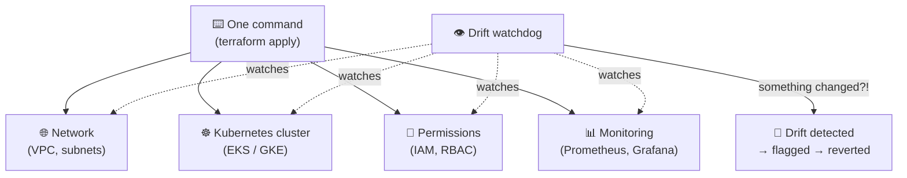

# Infra-Forge 🏗️

**One command builds a complete, secure cloud foundation — and a watchdog proves
nobody changed it behind your back.**

## Why this exists

Setting up cloud infrastructure by hand is slow (days), inconsistent (every
environment slightly different), and fragile (someone tweaks one setting at 2 AM
and nobody knows until something breaks).

Infra-Forge fixes all three: it defines the *entire* platform — network,
Kubernetes cluster, permissions, monitoring — as code, builds it with a single
command, and continuously checks that reality still matches the blueprint. Any
out-of-band change gets caught and can be reverted.



## What it builds

| Piece | Plain English |
|---|---|
| **Network (VPC)** | A private, segmented network so workloads are isolated from the internet and each other |
| **Kubernetes (EKS/GKE)** | The cluster your applications run on — AWS and Google versions included |
| **IAM & RBAC** | Least-privilege permissions: every person and service can only touch what it needs |
| **Guardrails** | Resource quotas (no team can starve the others) and network policies (pods only talk to who they should) |
| **Observability** | Prometheus + Grafana monitoring, installed automatically |
| **Drift detection** | A watchdog script that compares the live cluster against the blueprint — catches manual changes |

## The drift demo (the fun part)

```bash
cd demo/k8s-platform
terraform apply -auto-approve     # builds a 15-resource hardened baseline

../../scripts/drift-detect.sh     # ✅ NO DRIFT — cluster matches blueprint

# now sneak in a manual change, like a teammate would at 2am:
kubectl label namespace apps drift-demo=true

../../scripts/drift-detect.sh     # 🚨 DRIFT DETECTED — shows exactly what changed
```

Think of it as a **security camera for your cloud setup**: the blueprint is the
plan, the watchdog is the camera, and drift is anything that wasn't in the plan.

## Proven, not promised

Measured 2026-10-02 — no estimates:

- ✅ `terraform validate` clean on all modules (AWS + GCP)
- ✅ `tflint` — zero issues
- ✅ Demo builds **15 resources** against a live cluster API
- ✅ Drift watchdog: clean → detected → reverted, all verified end-to-end

<details>
<summary><b>🛠️ For engineers — modules, GCP, CI</b></summary>

### Architecture

```
┌─────────────────────────────────────────────────────────────┐
│  terraform apply   (root)                                   │
│  modules/vpc ──► VPC, 2 AZs, public/private subnets, IGW, NAT │
│  modules/eks ──► EKS cluster + managed node group, IRSA      │
│  modules/iam ──► cluster-admin role (MFA) + ci-deployer role  │
│  modules/observability ──► kube-prometheus-stack (Helm)      │
└─────────────────────────────────────────────────────────────┘
┌─────────────────────────────────────────────────────────────┐
│  enable_gcp = true  (opt-in, off by default)                │
│  modules/gcp ──► private VPC-native GKE cluster,            │
│                   Workload Identity (the GCP equivalent      │
│                   of IRSA — no service-account keys)        │
└─────────────────────────────────────────────────────────────┘
```

### Repo layout

```
├── main.tf / variables.tf / outputs.tf / versions.tf   # AWS root
├── terraform.tfvars.example
├── modules/
│   ├── vpc/             # 2-AZ network, NAT, route tables
│   ├── eks/             # cluster, node group, IRSA
│   ├── iam/             # cluster-admin + ci-deployer roles (least privilege)
│   ├── gcp/             # private GKE cluster + Workload Identity (opt-in)
│   └── observability/   # kube-prometheus-stack + Grafana dashboard
├── demo/k8s-platform/   # live demo: namespaces, RBAC, quotas, policies
├── scripts/drift-detect.sh
├── docs/DESIGN.md        # design rationale and tradeoffs
└── .github/workflows/ci.yml
```

### GCP path (opt-in)

Set in `terraform.tfvars`:

```hcl
enable_gcp     = true
gcp_project_id = "my-project-123456"
gcp_region     = "asia-south1"
```

Validated via `terraform init -backend=false` + `terraform validate` (no GCP
credentials in this environment — a real apply needs
`GOOGLE_APPLICATION_CREDENTIALS`).

### How drift detection works

`terraform plan -detailed-exitcode`: exit `0` = clean, `2` = drift, anything else
= error. The script wraps that contract into a CI-friendly verdict with no
dependencies beyond bash and terraform.

### Full measured results

| Check | Result |
|---|---|
| `terraform validate` (root + 5 modules, both `enable_gcp` values) | Success |
| `terraform fmt -check -recursive` | Clean |
| `tflint --recursive` | 0 issues |
| Demo `terraform apply` | 15 added, 0 changed, 0 destroyed |
| Drift check, clean state | NO DRIFT, exit 0 |
| Drift check after out-of-band `kubectl label` | DRIFT DETECTED, exit 2, diff shown |
| Drift check after revert | NO DRIFT, exit 0 |

Not done here: the AWS/GCP modules were validated, not applied (no cloud
credentials in this environment).

</details>

---
Built by [Shrikar Kaduluri](https://github.com/Parker2127) — DevOps Engineer.
